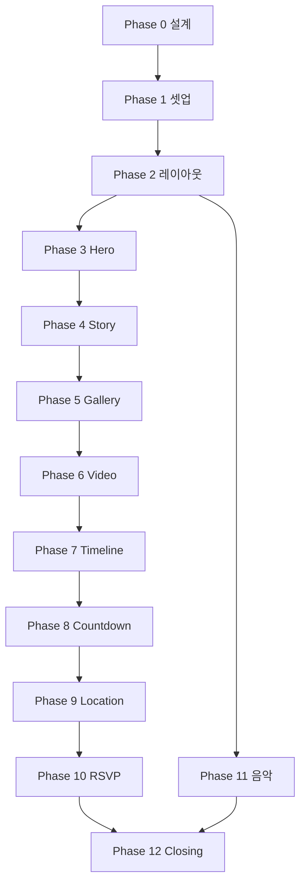

# 구현 단계 계획서

> 12단계 순차 개발 로드맵

---

## 현재 단계 / 다음 단계 표기 규칙

각 단계 완료 시:
- **현재 단계**: N단계 — [단계명] ✅
- **다음 단계**: N+1단계 — [단계명]

---

## Phase 0 — 설계 (선행)

| # | 작업 | 산출물 |
|---|------|--------|
| 0-1 | 프로젝트 구조도 | `docs/01-project-structure.md` |
| 0-2 | 구현 계획서 | `docs/02-implementation-plan.md` |
| 0-3 | 컴포넌트 설계서 | `docs/03-component-design.md` |
| 0-4 | 애니메이션 설계서 | `docs/04-animation-design.md` |
| 0-5 | 개발 체크리스트 | `docs/05-development-checklist.md` |

---

## Phase 1 — 프로젝트 셋업

| # | 작업 | 예상 산출 |
|---|------|-----------|
| 1-1 | `create-next-app` (App Router, TS, Tailwind) | 프로젝트 스캐폴딩 |
| 1-2 | 의존성 설치 (gsap, lenis, framer-motion, swiper, lucide) | package.json |
| 1-3 | 폴더 구조 생성 | src/, public/ 하위 디렉토리 |
| 1-4 | config 파일 (site, content, theme) | 초기 더미 데이터 |
| 1-5 | public asset placeholder | .gitkeep, README |

**완료 기준**: `npm run dev` 정상 실행

---

## Phase 2 — 공통 레이아웃 (2단계)

| # | 작업 |
|---|------|
| 2-1 | Google Font (Cormorant Garamond + Noto Sans KR) |
| 2-2 | globals.css — CSS 변수, Lenis 스타일 |
| 2-3 | theme.ts + tailwind.config 확장 |
| 2-4 | layout.tsx — 메타, SmoothScrollProvider |
| 2-5 | SectionWrapper, 배경 그라데이션/노이즈 |

**완료 기준**: Cream/Beige/Warm Gray 테마, 스무스 스크롤 동작

---

## Phase 3 — Hero Section (3단계)

| # | 작업 |
|---|------|
| 3-1 | HeroSection 컴포넌트 |
| 3-2 | 배경 영상 + 오버레이 |
| 3-3 | 텍스트 stagger fade-in (GSAP) |
| 3-4 | 패럴랙스 (ScrollTrigger scrub) |
| 3-5 | ScrollIndicator |

**완료 기준**: 100vh Hero, Apple 스타일 등장 애니메이션

---

## Phase 4 — Story Section (4단계)

| # | 작업 |
|---|------|
| 4-1 | StorySection — content.ts 데이터 바인딩 |
| 4-2 | Fade In + Slide Up (ScrollTrigger) |
| 4-3 | 이미지 Zoom In reveal |

**완료 기준**: 스크롤 시 문구·사진 순차 등장

---

## Phase 5 — Gallery Section (5단계)

| # | 작업 |
|---|------|
| 5-1 | Swiper 설정 (autoplay, pagination, navigation) |
| 5-2 | 슬라이드 전환 + hover scale |
| 5-3 | Dynamic import (SSR off) |

**완료 기준**: 모바일 스와이프, 자동 슬라이드

---

## Phase 6 — Video Section (6단계)

| # | 작업 |
|---|------|
| 6-1 | VideoSection — muted autoplay loop |
| 6-2 | ScrollTrigger 진입 시 play/pause |
| 6-3 | Fade-in 등장 |

**완료 기준**: 스크롤 진입 시 영상 재생

---

## Phase 7 — Timeline Section (7단계)

| # | 작업 |
|---|------|
| 7-1 | TimelineSection — 연도별 데이터 |
| 7-2 | 좌우 교차 slide-in |
| 7-3 | ScrollTrigger pin (선택) |

**완료 기준**: 2024/2025/2026 교차 등장

---

## Phase 8 — Countdown Section (8단계)

| # | 작업 |
|---|------|
| 8-1 | useCountdown 훅 |
| 8-2 | Day/Hour/Minute/Second UI |
| 8-3 | 숫자 flip 또는 fade 업데이트 |

**완료 기준**: 실시간 카운트다운

---

## Phase 9 — Location Section (9단계)

| # | 작업 |
|---|------|
| 9-1 | 주소 표시 |
| 9-2 | 카카오/네이버/구글맵 링크 버튼 |
| 9-3 | 지도 iframe 또는 정적 이미지 |

**완료 기준**: 길찾기 버튼 동작

---

## Phase 10 — RSVP Section (10단계)

| # | 작업 |
|---|------|
| 10-1 | 참석/불참 버튼 UI |
| 10-2 | Google Form URL 연동 (site.ts) |
| 10-3 | Framer Motion 버튼 인터랙션 |

**완료 기준**: 클릭 시 Google Form 새 탭

---

## Phase 11 — Background Music (11단계)

| # | 작업 |
|---|------|
| 11-1 | useBackgroundMusic 훅 |
| 11-2 | 첫 진입 MusicConsentModal |
| 11-3 | FloatingMusicButton (하단 고정) |

**완료 기준**: ON/OFF, 파일 경로 config화

---

## Phase 12 — Closing Section (12단계)

| # | 작업 |
|---|------|
| 12-1 | ClosingSection — 감사 메시지 |
| 12-2 | Text Reveal (GSAP SplitText 또는 clip-path) |
| 12-3 | Particle 느낌 (CSS/Canvas dots) |
| 12-4 | Fade out 마무리 |

**완료 기준**: 마지막 화면 감성적 마무리

---

## 의존성 순서 다이어그램

---

## 예상 일정 (참고)

| Phase | 예상 |
|-------|------|
| 0 | 1일 |
| 1–2 | 0.5일 |
| 3–6 | 1일 |
| 7–10 | 1일 |
| 11–12 | 0.5일 |

**총**: 약 4일 (1인 기준)
