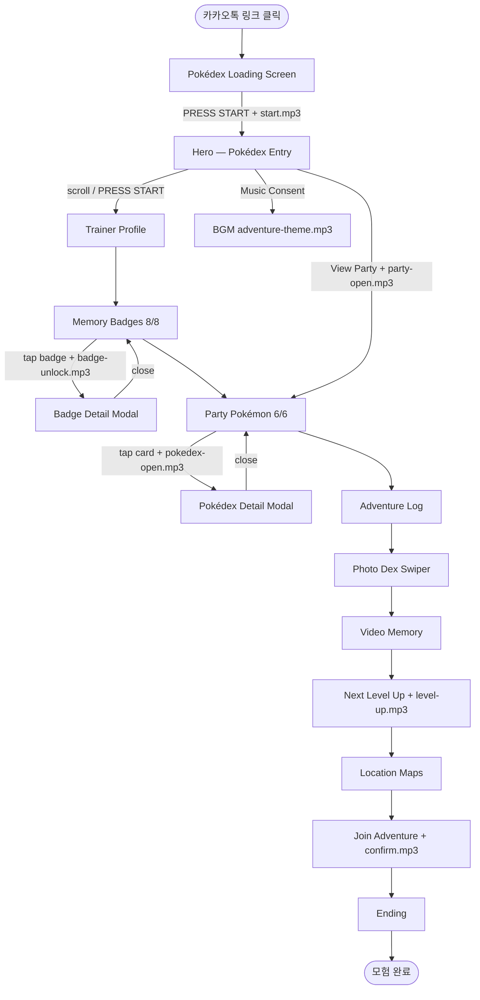
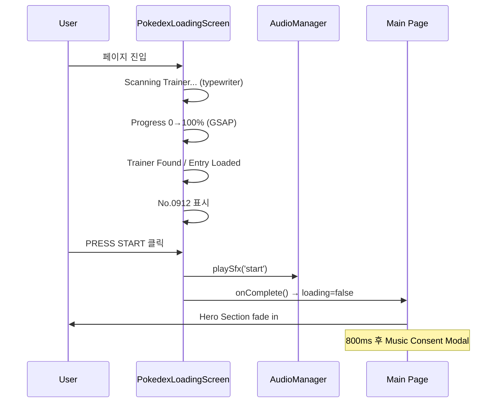
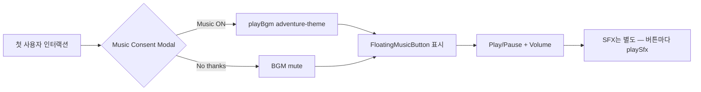
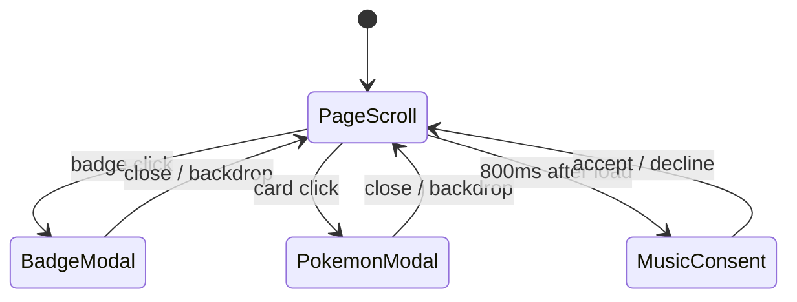
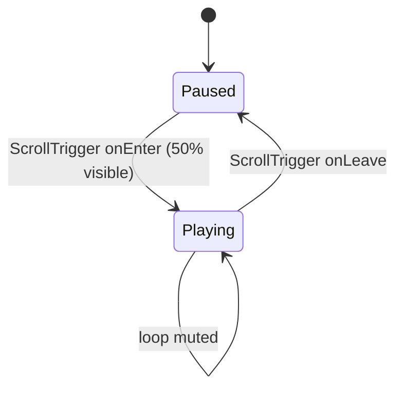

# 04 — Page Flow Diagram

> 사용자 여정 · 스크롤 플로우 · 인터랙션 · 사운드 트리거

---

## 1. 전체 사용자 여정



---

## 2. 로딩 게이트 플로우



---

## 3. 오디오 동의 플로우



**정책:** BGM·SFX 모두 **사용자 gesture 이후**만 재생 (iOS Safari autoplay policy)

---

## 4. 섹션별 스크롤 플로우 (Mobile)

```
┌─────────────────────────┐
│  Pokédex Loading (gate) │  fixed overlay, 100vh
└───────────┬─────────────┘
            ▼
┌─────────────────────────┐
│  Hero          100vh    │  #hero — floating decor
│  CURRENT PARTY preview  │
└───────────┬─────────────┘
            ▼ scroll
┌─────────────────────────┐
│  Trainer Profile        │  #profile — stat screen
└───────────┬─────────────┘
            ▼
┌─────────────────────────┐
│  Memory Badges  2×4     │  #badges — tap → modal
└───────────┬─────────────┘
            ▼
┌─────────────────────────┐
│  Party Pokémon  2×3     │  #party — tap → dex modal
└───────────┬─────────────┘
            ▼
┌─────────────────────────┐
│  Adventure Log          │  #log — timeline
└───────────┬─────────────┘
            ▼
┌─────────────────────────┐
│  Photo Dex   Swiper     │  #photos — 9:16
└───────────┬─────────────┘
            ▼
┌─────────────────────────┐
│  Video Memory           │  #video — scroll play
└───────────┬─────────────┘
            ▼
┌─────────────────────────┐
│  Next Level Up          │  #levelup — countdown
└───────────┬─────────────┘
            ▼
┌─────────────────────────┐
│  Location               │  #location — map links
└───────────┬─────────────┘
            ▼
┌─────────────────────────┐
│  Join Adventure         │  #rsvp — 3 buttons
└───────────┬─────────────┘
            ▼
┌─────────────────────────┐
│  Ending                 │  #ending — closing
└─────────────────────────┘

[FloatingMusicButton] ─── fixed bottom-right (전 구간)
```

---

## 5. 인터랙션 맵

| 트리거 | 액션 | SFX | Scroll Target |
|--------|------|-----|---------------|
| Loading PRESS START | 게이트 해제 | `start.mp3` | `#hero` |
| Hero PRESS START | 프로필로 이동 | `start.mp3` | `#profile` |
| Hero View Party | 파티로 이동 | `party-open.mp3` | `#party` |
| Badge tap | Modal open | `badge-unlock.mp3` | — |
| Pokémon card tap | Dex modal open | `pokedex-open.mp3` | — |
| Generic button | — | `click.mp3` | — |
| Level Up in view | EXP animation | `level-up.mp3` (once) | — |
| Join Adventure | Google Form | `confirm.mp3` | external |
| Music ON | BGM start | — | — |
| Floating btn | toggle BGM | — | — |

---

## 6. Modal 스택



- Modal z-index: `z-50`
- Backdrop: semi-transparent cream + blur
- Close: X button + backdrop tap + Escape key

---

## 7. Hero → Party Shortcut

Hero 하단 **CURRENT PARTY** 프리뷰:

```
🌊 🎉 🔥 🌙 🧬 ⚡
View Party →
```

- Emoji는 `pokemon.json`에서 `emoji` 필드 추출
- Lenis `scrollTo('#party', { offset })` 사용
- ScrollTrigger refresh after navigation

---

## 8. Video Memory Scroll Behavior



---

## 9. Countdown Tick Flow

```
useCountdown(eventDate) — client only (dynamic import, ssr:false)
  → setInterval 1000ms
  → days / hours / minutes / seconds
  → EXP bar width = f(time remaining)
  → eventDate 도달 시 "LEVEL UP!" flash
```

---

## 10. v1 → v2 플로우 변경점

| 항목 | v1 (현재 코드) | v2 (스펙) |
|------|----------------|-----------|
| Profile 다음 | Adventure Log | **Memory Badges** |
| Badges 다음 | Party | **Party** (동일) |
| Party 다음 | Photo Dex | **Adventure Log** |
| Badge 수 | 6 | **8** |
| Party modal | 없음 | **Pokédex Detail** |
| Hero party preview | 없음 | **CURRENT PARTY strip** |

---

## 11. 성공 UX 시나리오 (90초)

1. **0–5s:** Pokédex 스캔 → "Trainer Found" → PRESS START
2. **5–15s:** Hero — No.0912, 이름, floating decor
3. **15–30s:** Profile — HP/EXP/BADGES 8/8 확인
4. **30–45s:** Badge 탭 → 추억 스토리 1~2개 열람
5. **45–60s:** Party 카드 탭 → Lapras/Victini 상세
6. **60–75s:** Photo Dex 스와이프 + Video
7. **75–90s:** Countdown 확인 → Join Adventure

> 목표: **90초 안에 "트레이너 Pokédex 탐험" 감각** 전달
